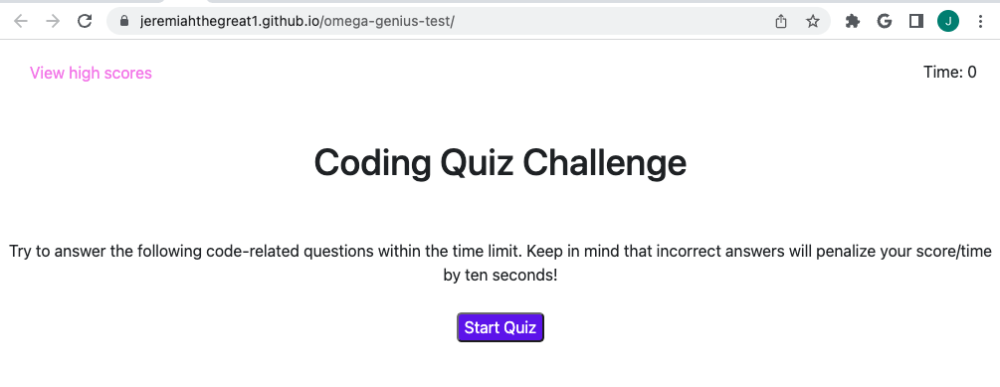

# omega-genius-test

## Description
This application is a small quiz for testing knowledge on concepts from javascript.  I built this application because I wanted to test my own knowledge on javascript while also learning a real world application for the concepts learned.  This quiz allows anybody who administers it to verify that their perspective coder has base level javascript knowledge.  I learned so much about how if/else statements can be used, and how to write successful functions in js.

## Installation

To access the quiz, visit https://jeremiahthegreat1.github.io/omega-genius-test/.  No additional steps are required.  For best results, access using a desktop.

## Usage

For best results, access using a desktop.

To add a screenshot, create an `assets/images` folder in your repository and upload your screenshot to it. Then, using the relative file path, add it to your README using the following syntax:

## Credits

Credit to lessons from UNH Coding Bootcamp modules. I was also inspired by code at https://www.w3schools.com/jsref/tryit.asp?filename=tryjsref_element_addeventlistener2 that assisted me with added event listeners.

## License

MIT License

Copyright (c) 2023 jeremiahthegreat1

Permission is hereby granted, free of charge, to any person obtaining a copy
of this software and associated documentation files (the "Software"), to deal
in the Software without restriction, including without limitation the rights
to use, copy, modify, merge, publish, distribute, sublicense, and/or sell
copies of the Software, and to permit persons to whom the Software is
furnished to do so, subject to the following conditions:

The above copyright notice and this permission notice shall be included in all
copies or substantial portions of the Software.

THE SOFTWARE IS PROVIDED "AS IS", WITHOUT WARRANTY OF ANY KIND, EXPRESS OR
IMPLIED, INCLUDING BUT NOT LIMITED TO THE WARRANTIES OF MERCHANTABILITY,
FITNESS FOR A PARTICULAR PURPOSE AND NONINFRINGEMENT. IN NO EVENT SHALL THE
AUTHORS OR COPYRIGHT HOLDERS BE LIABLE FOR ANY CLAIM, DAMAGES OR OTHER
LIABILITY, WHETHER IN AN ACTION OF CONTRACT, TORT OR OTHERWISE, ARISING FROM,
OUT OF OR IN CONNECTION WITH THE SOFTWARE OR THE USE OR OTHER DEALINGS IN THE
SOFTWARE.

---
